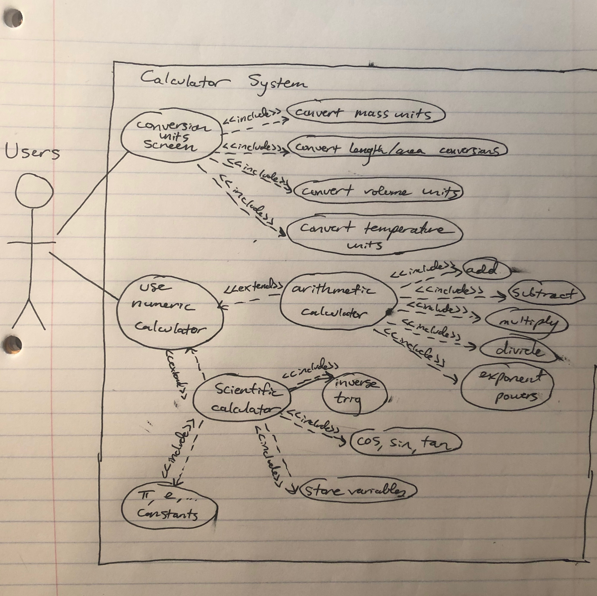

1<h2 align="center"> Software Requirements Specification (SRS)

for Multifunction Calculator Application </h3>

#### Definitions, Acronyms, and Abbreviations
Word/phrase   | Meaning
--------------|----------------------
should        | Desirable requirement
shall     | Mandatory requirement

#### Functional Requirements

```
1. The user shall be able to access different views.
  1.1. The user shall be able to access a simple arithmetic calculator.
  1.2. The user should be able to access a scientific calculator.
  1.3. The user shall be able to access a unit conversion calculator.
```

```
2. The user shall be able to convert units.
  2.1 The user shall be able to perform conversions between mass units.
  2.2 The user shall be able to perform conversions between length/area units.
  2.3 The user shall be able to perform conversions volume units.
  2.4 The user shall be able to convert temperatures between Fahreneit, Celsius, and Kelvins.
  2.5 The user shall be able to update one text field and the other fields should automatically update.
```

```
3. The user shall be able to perform basic arithmetic calculations.
  3.1 The user shall be able to add, subtract, multiply, and divide real numbers.
  3.2 The user shall be able to use parentheses.
```

#### Use Case Diagram


